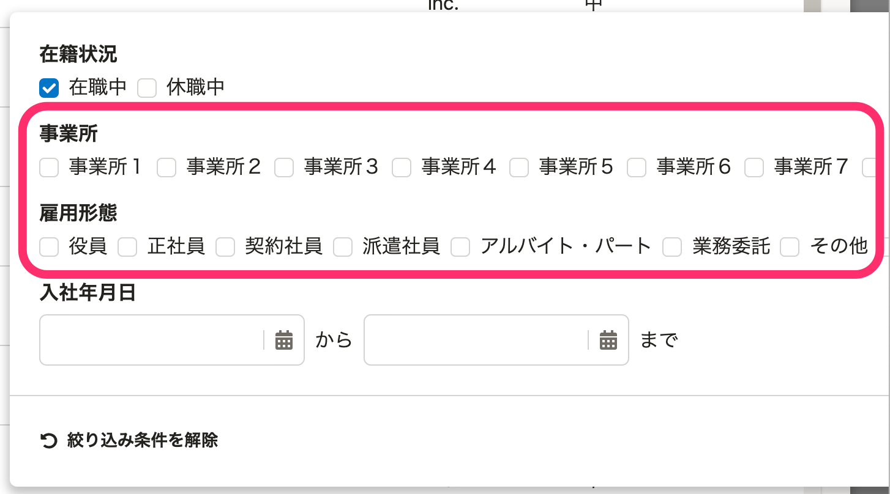
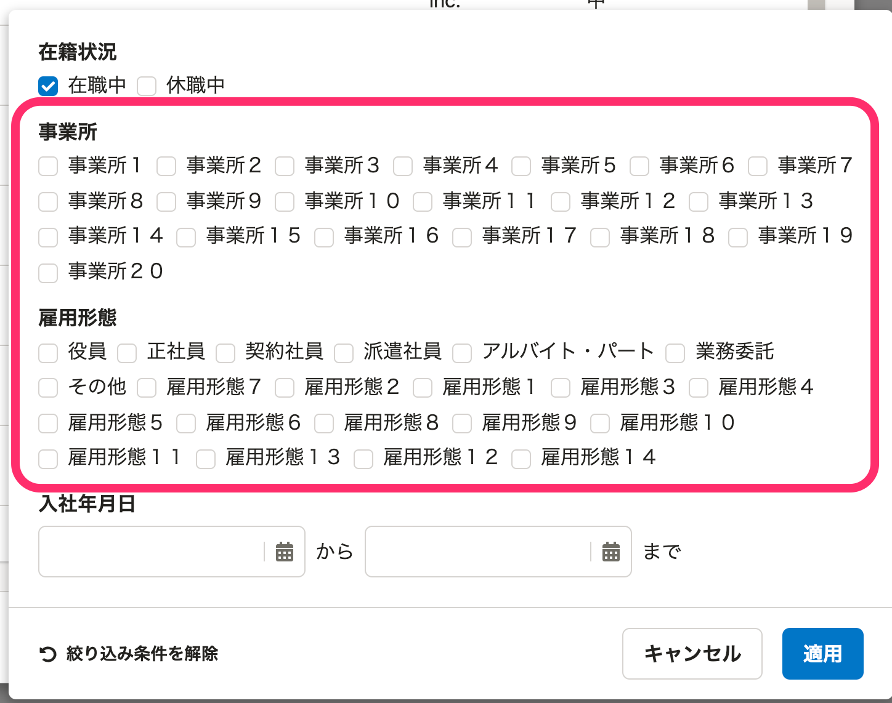

2022年01月25日（火）〜 2022年01月31日（月）に行なったアップデートの詳細をお知らせします。

人事評価機能の変更点は、不具合修正4件でした。

# 🐛不具合修正

## 評価対象者一覧に、意図せず自身の評価シートが表示される不具合を修正しました。

 **［評価対象者一覧］** に表示する対象を「確認・入力が必要な評価シート」で絞り込んだ際に、意図せず自身の評価シートが表示される不具合がありました。
今回の変更で、自身の評価シートを除いた評価対象者のみを表示するように修正しました。

## 評価対象者の絞り込みで、絞り込み条件の選択肢が多いと画面が見切れる不具合を修正しました。

 **［評価プロジェクト］** の **［評価対象者の追加］** で評価対象にする従業員の絞り込みを行う際に、事業所や雇用形態の選択肢が画面から見切れることがある不具合がありました。
今回の変更で、選択肢が多い場合は画面の端で折り返して表示するように修正しました。

| before | after |
| --- | --- |
|  |  |

## 評価者・評価共有者設定の［設定用ファイルの取り込む］で、評価者と評価共有者を入れ替えて取り込めない不具合を修正しました。

 **［評価プロジェクト］** の評価者・評価共有者設定の **［設定用ファイルの取り込む］** でCSVファイルを取り込む際に、すでに登録されている評価者と評価共有者を入れ換えたCSVファイルを取り込むとエラーが発生する不具合がありました。
今回の変更で、評価者と評価共有者を入れ換えたCSVファイルを取り込めるように修正しました。

## 評価者・評価共有者設定の［設定用ファイルの取り込む］で、評価者の名前が空のときに原因不明のエラーが発生する不具合を修正しました。

 **［評価プロジェクト］** の評価者・評価共有者設定の **［設定用ファイルの取り込む］** で評価者の名前を空のCSVファイルを取り込むと、原因不明のエラーが発生した旨のエラーメッセージが表示される不具合がありました。
今回の変更で、評価者の名前が空の場合は適切なエラーメッセージが表示されるように修正しました。
