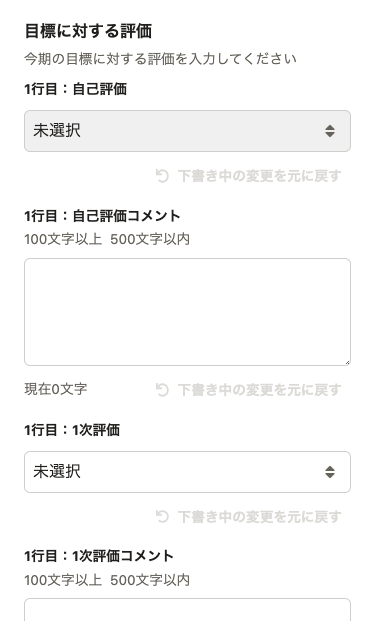
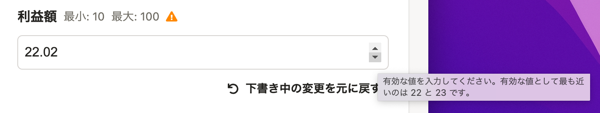

2022年02月01日（火）〜 2022年02月7日（月）に行なったアップデートの詳細をお知らせします。

人事評価機能の変更点は、新機能1件、改善3件、不具合修正2件でした。

# ✨新機能

## 評価テンプレートを評価プロジェクトに取り込んだ後からでも、編集できるようになりました

これまでは評価プロジェクトに取り込んだ評価テンプレートが編集できず、評価開始後に変更を加えたい場合は、評価業務をやり直す必要がありました。

本機能のリリースにより、評価を開始した後でも使用中の評価シートなどに変更を加えることが可能になりました。

詳細は[お知らせ](https://smarthr.jp/update/32532)を参照してください。

# 🚸💬改善

## ［評価テンプレート編集］の［評価ロール］で編集ができない状態にも関わらず、表示されていたドロップダウンを非表示にしました

すでに評価が開始されている場合、取り込み済みテンプレートのうち、評価ロールは変更できません。しかし、 **［評価ロール］** の設定画面の **［操作］** のドロップダウンを開くことができるようになっていました。

編集が制御されているときは不必要にドロップダウンを表示しないように修正しました。

## 表組みの評価フォームをモバイルで表示できるようにしました

モバイルから評価シートを閲覧したときに、表組みがデスクトップと同じように表示されていましたが、モバイルに最適化された表示を適用しました。

## 数値入力フォームがマウスのスクロールで値が変わらないように修正しました

数値入力フォームで、フォームを選択しているとマウスやトラックパッドをスクロールしたときに値が変わるようになっていました。数値入力後、意図しない入力値の変更操作に繋がるため、マウスをスクロールしても値が変わらないように修正しました。

# 🐛不具合修正

## セッションの有効期限が失効した場合に再ログインするようにしました

セッションの有効期限が失効した場合、アクセスできないエラーが発生していましたが、失効した場合でも再ログインするようにしました。

## ［評価シート］の数値入力フォームで意図せず警告が表示される不具合を修正しました

 **［評価シート** ］の数値入力フォームに小数点の数字を入力すると、ブラウザの警告が表示されることがある不具合がありました。
小数点以下の数値を入力しても警告が表示されないように修正しました。

| before | after |
| --- | --- |
|  | 警告が表示されない |
