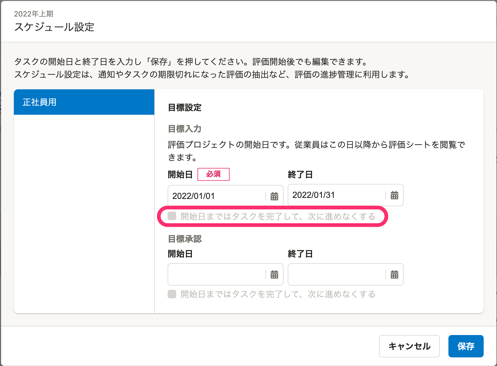
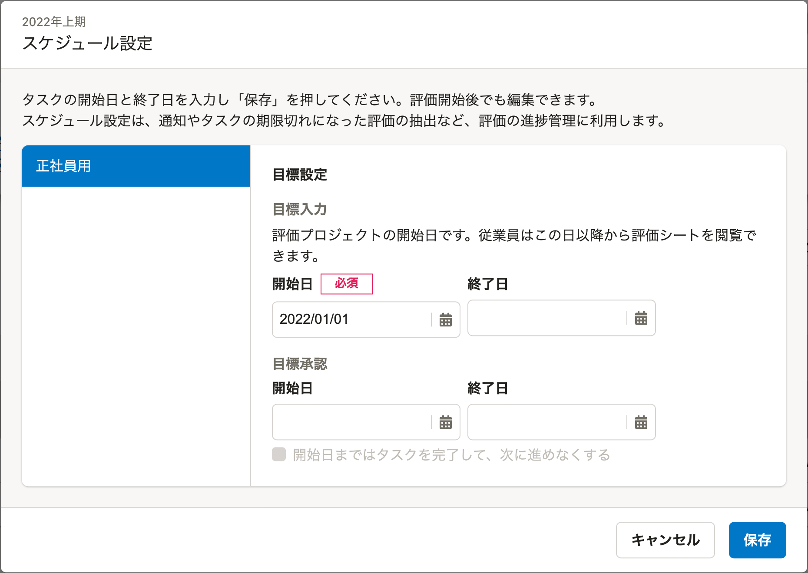
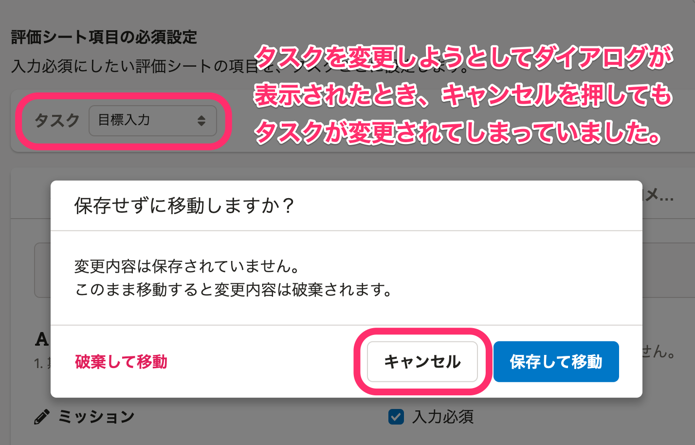

2022年02月08日（火）〜 2022年02月14日（月）に行なったアップデートの詳細をお知らせします。

人事評価機能の変更点は、改善3件、不具合修正2件でした。

# 🚸💬改善

## ［評価シート詳細］画面をモバイル表示に対応しました

 **［評価シート詳細］** 画面内のボタンやテキスト、ダイアログなどをモバイルでも見やすいようにUIを変更しました。まだ一部で見づらい箇所がありますが、今後対応予定です。

## ［スケジュール設定］画面から、最初のタスクのチェックボックスを非表示にしました

 **［評価プロジェクト］** の **［スケジュール設定］** 画面に、「開始日まではタスクを完了して、次に進めなくする」設定のチェックボックスがあります。
最初のタスクは、そもそもタスクの開始日まで評価シートを閲覧できないため、チェックボックスを利用できない状態にしていましたが、混乱を招きかねないため非表示にしました。

| before | after |
| --- | --- |
|  |  |

## 「評価フェーズ」という文言を「フェーズ」に変更しました

評価フローの中の要素であるタスクを束ねる「評価フェーズ」の名称を「フェーズ」に変更しました。
評価フローと評価フェーズが紛らわしいため、評価フロー＞フェーズ＞タスクという階層関係を理解しやすくするという意図から、評価という修飾語はフローのみに付けるように変更しました。

文言のみの変更で、機能に影響はありません。

# 🐛不具合修正

## ［評価者と評価共有者の設定］でCSV取り込みに失敗する不具合を修正しました

評価共有者は評価対象者ごとに最大50人設定できますが、すでに登録済みの評価共有者と新たに設定する評価共有者の合計人数が50人を超えた場合に、CSV取り込みがエラーになってしまう不具合がありました。

すでに登録済みの評価共有者の人数に関わらず、新たに設定する評価共有者の人数が50人以下の場合は正しく設定できるように修正しました。

## ［評価ロールの閲覧・編集権限設定］画面、［評価シート項目の必須設定］画面が正しく表示されない不具合を修正しました

以下2点の表示上の不具合を修正しました。 **［評価ロールの閲覧・編集権限設定］** 画面、［ **評価シート項目の必須設定］** 画面で設定している内容には影響ありません。

1.  **表組み内に設定した固定テキストフォーム**が空白で表示されており、一部の項目が分かりづらい状態になっていました。
    固定テキストの内容を表示するよう修正しました。
2.  変更内容を保存せずに別のタスクや評価種目を選択すると以下のダイアログが表示されます。
    別のタスクを選択した場合にダイアログの **［キャンセル］** をクリックしても、選択したタスクに移動してしまう問題がありました。
    ダイアログの **［キャンセル］** をクリック場合は、未保存のタスクに戻るように修正しました。

