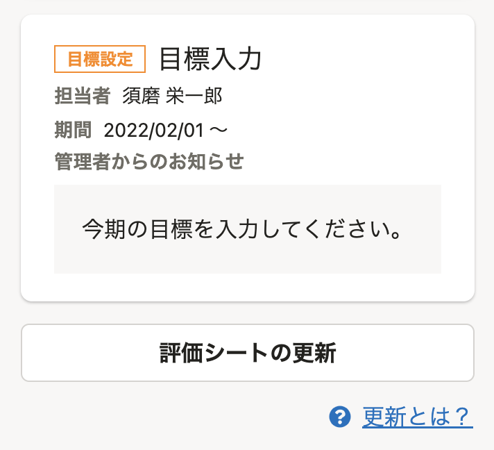

2022年02月22日（火）〜 2022年03月07日（月）に行なったアップデートの詳細をお知らせします。

人事評価機能の変更点は、新機能1件、改善6件、不具合修正1件でした。

# ✨新機能

## ［評価プロジェクト］で評価の停止ができるようになりました

進行中の評価を停止できるようになりました。

 **［評価プロジェクト］** 画面の **［評価一覧］** で進行中の評価を選択し、 **［その他の操作］**  >  **［停止］** から操作できます。

評価の停止中は、従業員は評価シートを閲覧できなくなります。

# 🚸💬⚡️改善

## ［評価フロー］の設定画面で、タスクの設定項目［説明（任意）］という文言を［管理者からのお知らせ（任意）］に変更しました

評価シートに **「管理者からのお知らせ」** という名称で表示する内容は **［評価テンプレート］** の **［評価フロー］** 設定画面で入力します。しかし、設定画面では **［説明（任意）］** という項目名で、説明文で「評価シートに「管理者からのお知らせ」として、タスク担当者にのみ表示されます。」と表記していました。

表示画面と設定画面で項目名が一致しないことで誤解を与えていたため、項目名を **［管理者からのお知らせ］** に揃えました。文言のみの変更で、機能に影響はありません。

| before | after |
| --- | --- |
|  |  |

##  評価シート一覧の［絞り込み条件の設定］で、確定状況で評価を絞り込めるようにしました

 **［評価プロジェクト］** 画面の評価シート一覧の **［絞り込み条件設定］** で確定状況で絞り込みができるようになりました。

| before | after |
| --- | --- |
|  |  |

## 取り込んだテンプレートの編集に関する説明をより詳しく記載しました

これまでは取り込んだ評価テンプレートの編集についての説明が不足しておりましたが、評価開始時、編集開始時、編集中でも詳細が分かるように修正しました。

| before | after |
| --- | --- |
|  |  |
| 該当なし |  |
|  |  |

## 評価一覧の操作ボタンの表示を変更しました

 **［評価プロジェクト］** 画面の **［評価一覧］** で、選択した評価を操作する **［評価を開始］** や **［評価を確定］** といったボタンのラベルと、配置を変更しました。

 **［評価者を設定］** はこれまで **［その他の操作］** の中に含まれていたため気づきにくく、使用頻度も高いため、独立させました。

| before | after |
| --- | --- |
|  |  |

## モバイル表示のデザインを一部変更しました

モバイル端末から評価シートを閲覧するときに、見えづらかったアイコンや文字サイズ、余白などを調整しました。

| before | after |
| --- | --- |
|  |  |
|  |  |
|  |  |
|  |  |

## バックグラウンド処理の速度が速くなりました

評価対象者追加や評価者設定などを含む、すべてのバックグラウンド処理にかかっていた時間が短縮されました。

# 🐛不具合修正

## ［権限設定］のヘルプページへのリンクに遷移先が設定されていない不具合を修正しました

SmartHRの管理者で、人事評価の権限がない場合に表示している **［権限設定］** 画面のヘルプページへのリンクに遷移先が設定されていなかったのでリンクを設定しました。
