# 🚸💬改善

## モバイル表示のデザインを一部変更しました

モバイル端末から評価シートを閲覧するときに、見えづらかったアイコンや文字サイズ、余白などを調整しました。

| before | after |
| --- | --- |
| 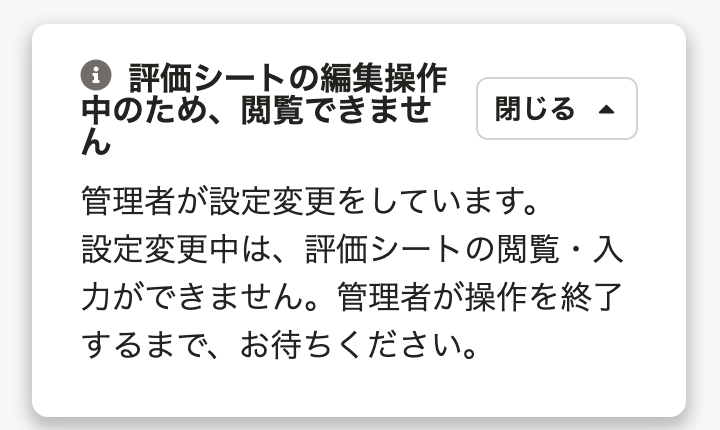 |  |
| 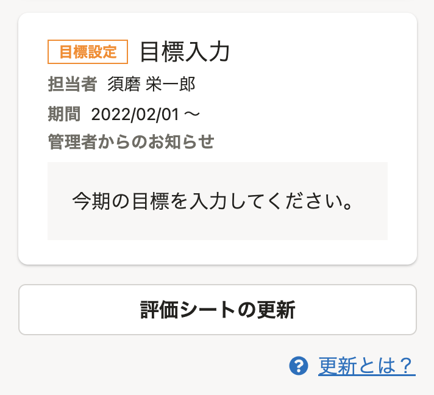 | 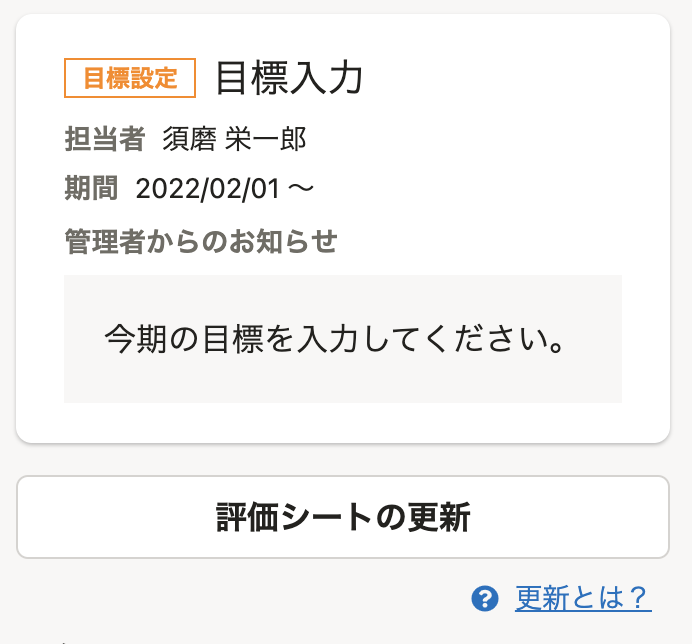 |
|  |  |
| 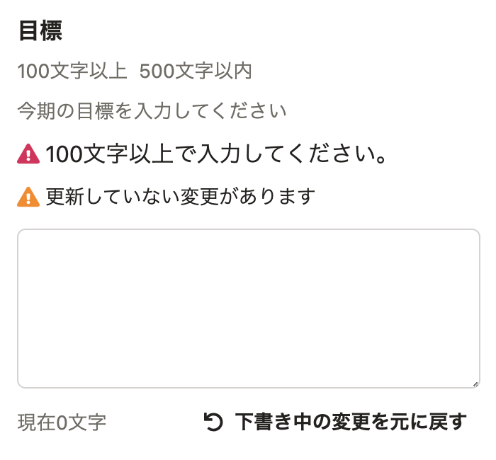 | 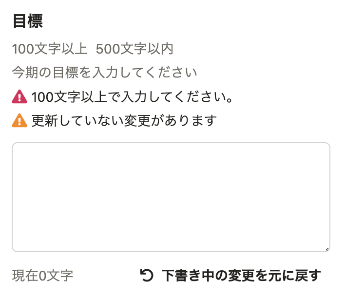 |

## 従業員が評価シートを閲覧できるタイミングの説明を修正しました

評価プロジェクトの **［スケジュール設定］** 内に、最初のタスクの開始日から従業員が評価シートを閲覧できる旨が記載されていました。実際は評価シートを入力できる日の設定であったため修正しました。

また、評価の開始時に表示されるダイアログに、より詳細な説明を記載しました。

| before | after |
| --- | --- |
| 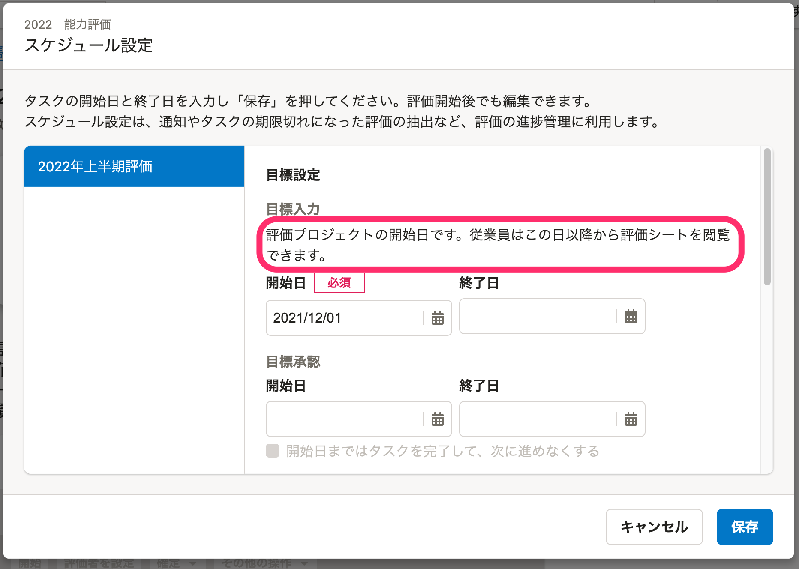 | 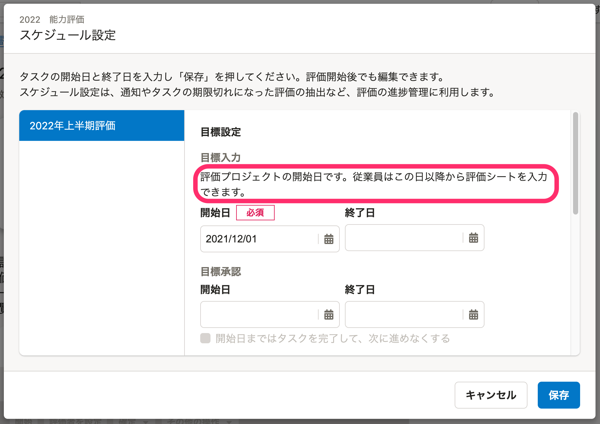 |
| 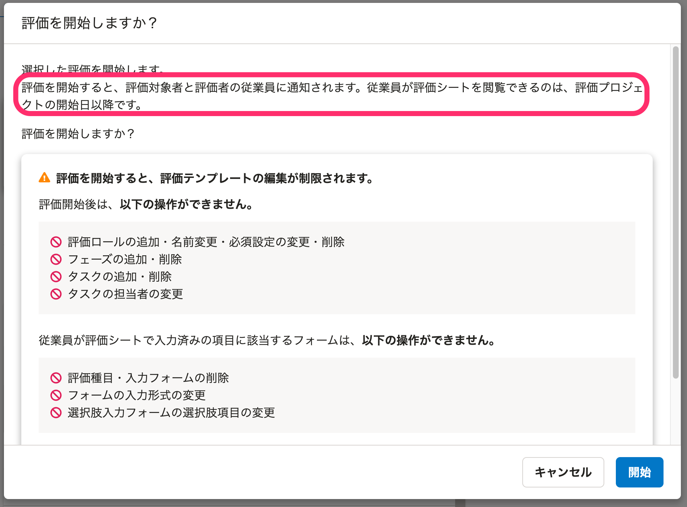 | 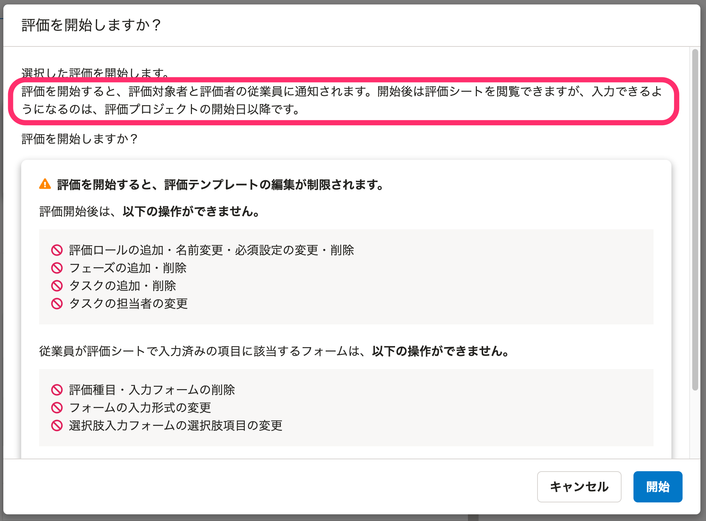 |

## ［評価シート］をモバイルで表示したときに、表組みの列の説明を表示するようにしました

 **［評価シート］** をモバイルで表示したときに、表組みの列に設定されている説明の項目が表示されていませんでした。
モバイルで表示したときにも、表組みの列に設定されている説明の項目を表示するように修正しました。

| before | after |
| --- | --- |
| 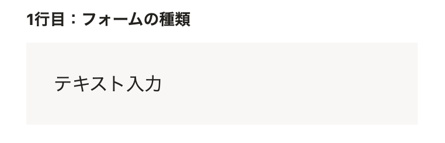 | 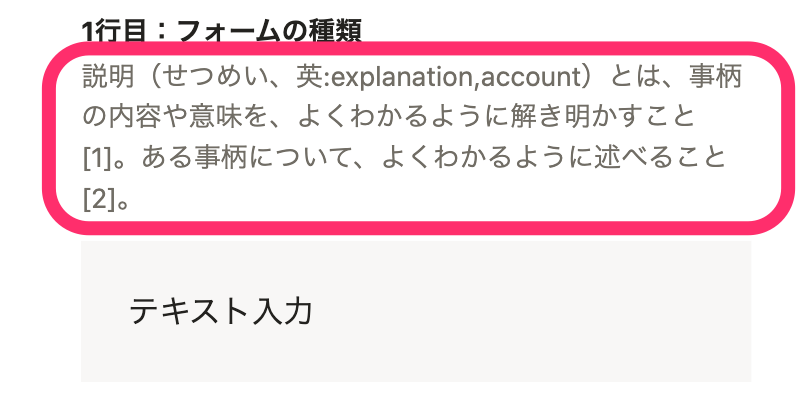 |

## ［評価シート］の表組みを行ごとに表示したときにも、列の説明を表示するようにしました

 **［評価シート］** で表組みを閲覧するときに行ごとに表示をすると、表組みの列に設定されている説明の項目が表示されていませんでした。
表組みの **［この行を表示］** をクリックした場合でも、表組みの列に設定されている説明の項目を表示するように修正しました。

| before | after |
| --- | --- |
| 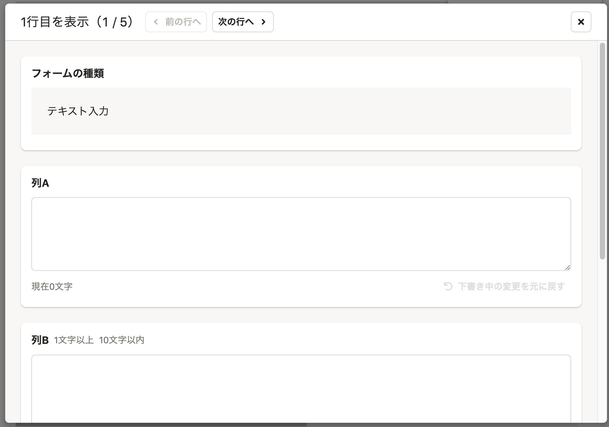 | 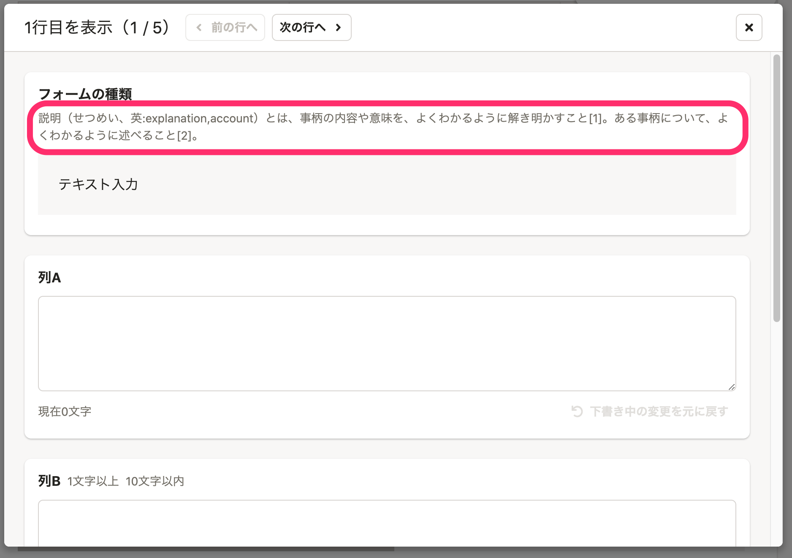 |
