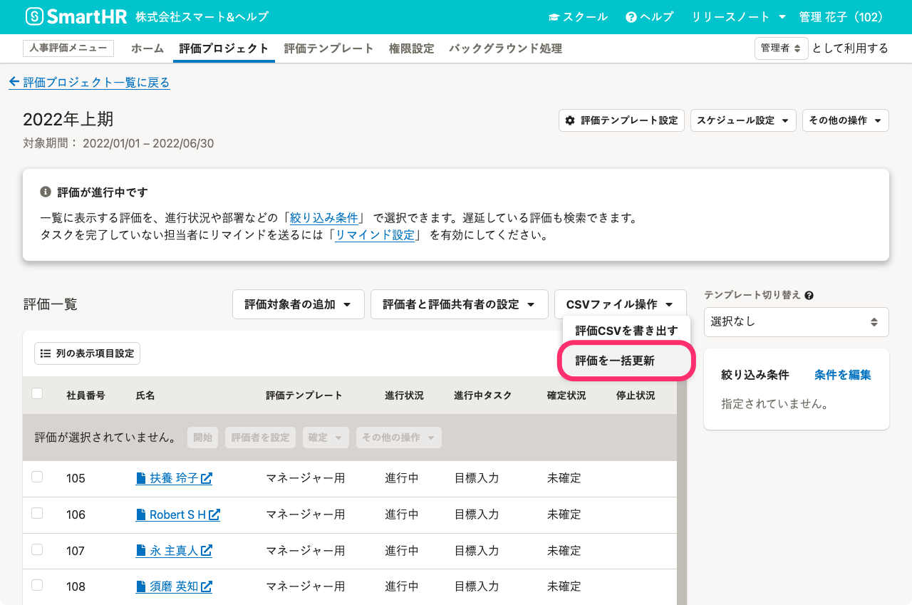

2022年03月23日（水）に行なったアップデートの詳細をお知らせします。

# ✨新機能

## 評価シートの内容をCSVファイルで一括更新できるようになりました

これまでは、管理者が評価シートの入力内容を変更するには、評価プロジェクトの **［評価一覧］** から評価対象者の評価シートを1枚ずつ開いて記入する必要がありました。

本機能のリリースにより、評価プロジェクト画面から評価シートの内容をCSVファイルをアップロードして一括更新できるようになりました。

この機能を利用できるのは、人事評価機能の機能管理者と業務担当者の権限を持つアカウントのみです。

詳しい使い方は、ヘルプページを参照してください。

[評価を一括更新する
](https://knowledge.smarthr.jp/hc/ja/articles/4883666091161-%E8%A9%95%E4%BE%A1%E3%82%92%E4%B8%80%E6%8B%AC%E6%9B%B4%E6%96%B0%E3%81%99%E3%82%8B)[【一覧】CSVファイルを使って一括更新できる評価シートのフォーム](https://knowledge.smarthr.jp/hc/ja/articles/5072694277913--%E4%B8%80%E8%A6%A7-CSV%E3%83%95%E3%82%A1%E3%82%A4%E3%83%AB%E3%82%92%E4%BD%BF%E3%81%A3%E3%81%A6%E4%B8%80%E6%8B%AC%E6%9B%B4%E6%96%B0%E3%81%A7%E3%81%8D%E3%82%8B%E8%A9%95%E4%BE%A1%E3%82%B7%E3%83%BC%E3%83%88%E3%81%AE%E3%83%95%E3%82%A9%E3%83%BC%E3%83%A0)
