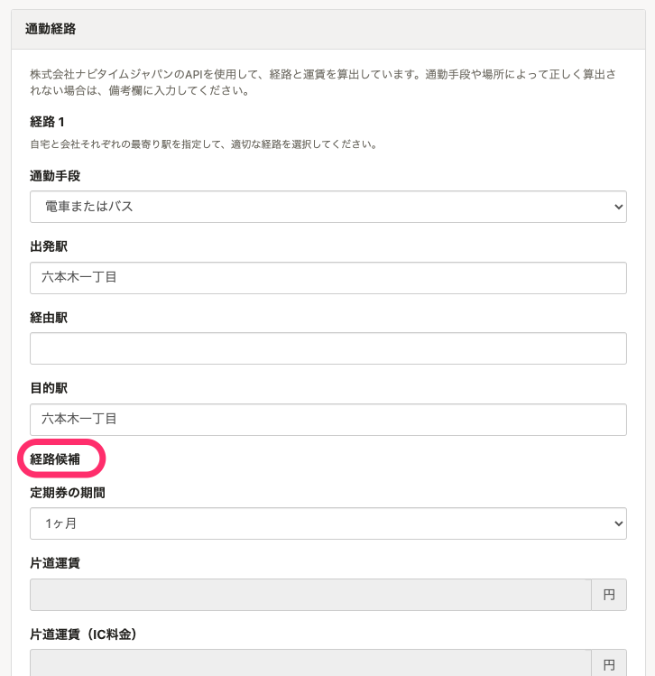
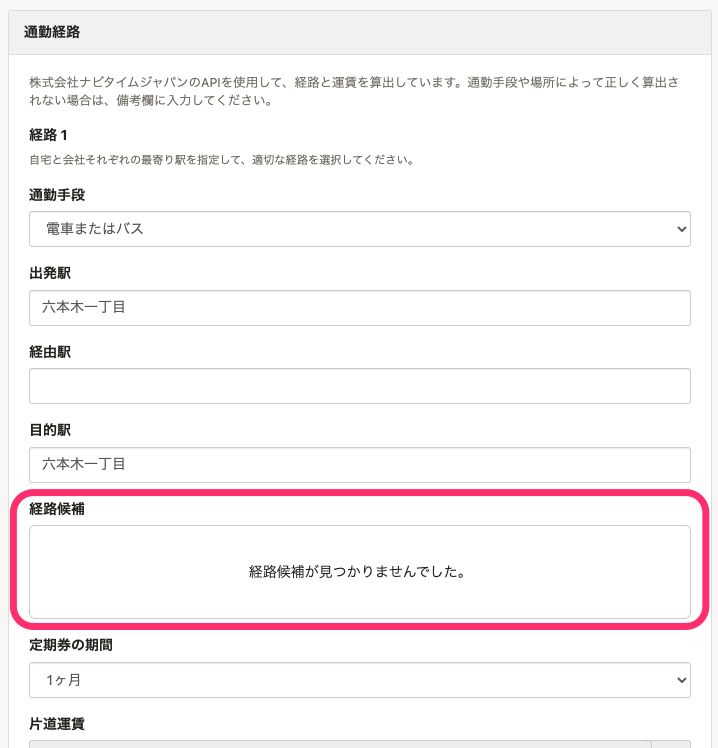

2022年2月18日（金）に行なったアップデートの詳細をお知らせします。

通勤経路検索機能の変更点は、改善1件でした。

# 📈 改善

## 通勤経路の候補がない場合にメッセージを表示するようにしました

これまでは、従業員情報の編集画面で通勤経路を検索した際、候補となる経路がないことを明示できていませんでした。

今回のリリースで、通勤経路の候補がなかったことを伝えるメッセージを表示するようにしました。

| 変更前 | 変更後 |
| --- | --- |
|  |  |
