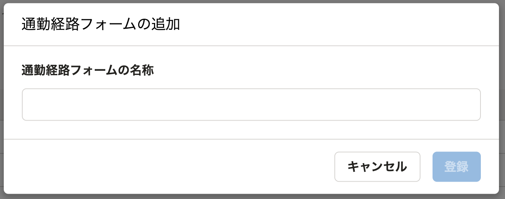
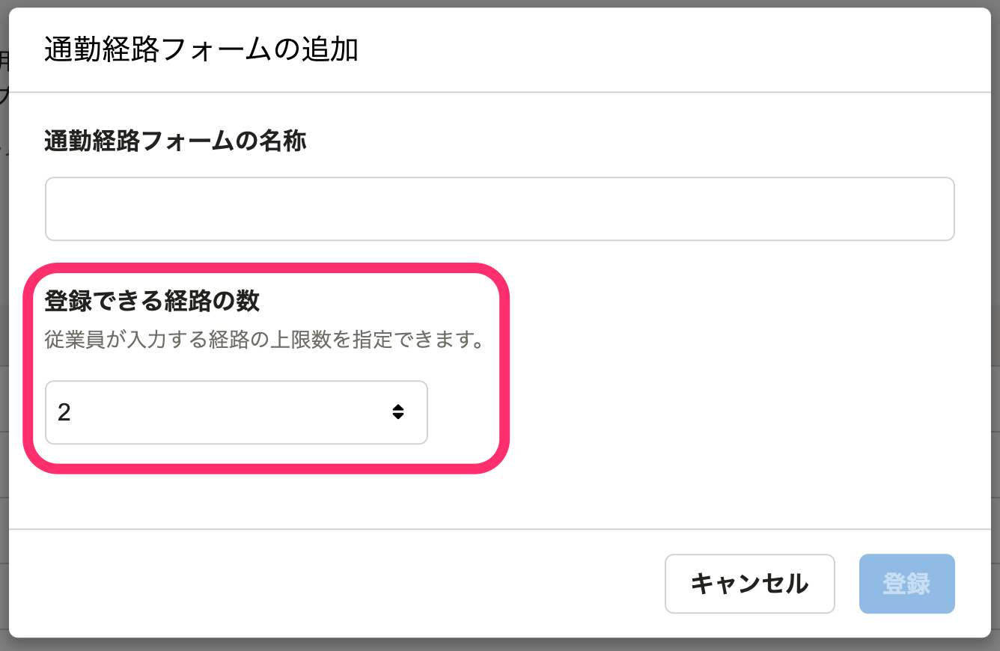

2022年2月24日（木）に行なったアップデートの詳細をお知らせします。

通勤経路検索機能の変更点は、改善1件でした。

# 📈 改善

## 従業員が登録できる通勤経路を最大5つまで設定できるようにしました

これまでは、従業員が登録できる通勤経路を1つの通勤経路フォームにつき2つまでしか設定できませんでした。

今回のリリースで、登録できる通勤経路の数を最大5つまで設定できるようにしました。

通勤経路フォームを追加する際に設定できます。

| 変更前 | 変更後 |
| --- | --- |
|  |  |
