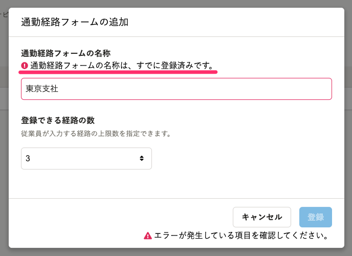

2022年3月1日（火）に行なったアップデートの詳細をお知らせします。

通勤経路検索機能の変更点は、改善1件でした。

# 📈 改善

## カスタム項目グループと同じ名前で通勤経路フォームを作成しようとしたときのエラーメッセージを改善しました

カスタム項目グループと同じ名前で通勤経路フォームを作成しようとしたときに表示されるメッセージが、エラーの原因を確認しづらい内容になっていました。

今回のリリースで、すでに登録されている名称が入力されたことでエラーが発生したと伝わるメッセージに改善しました。

