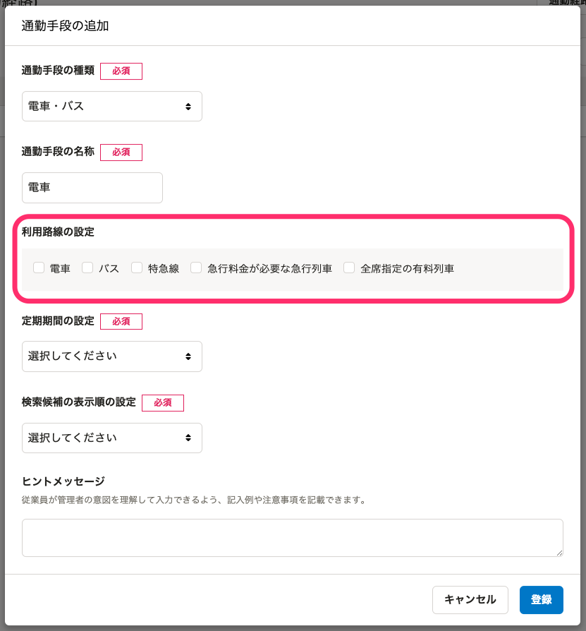
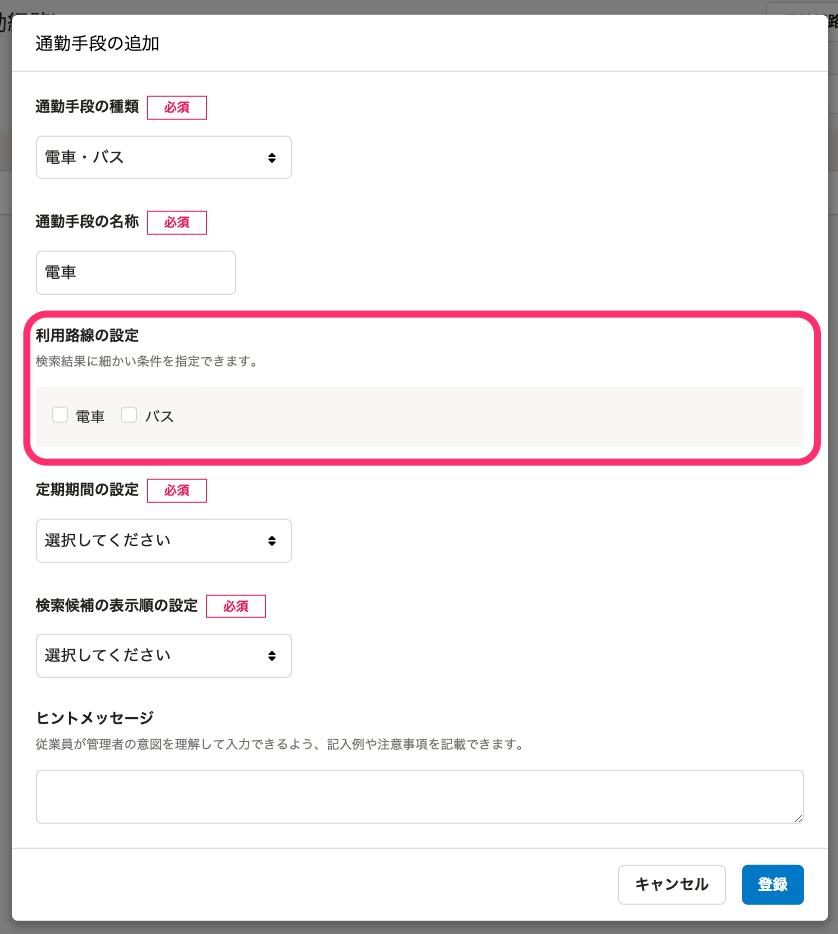
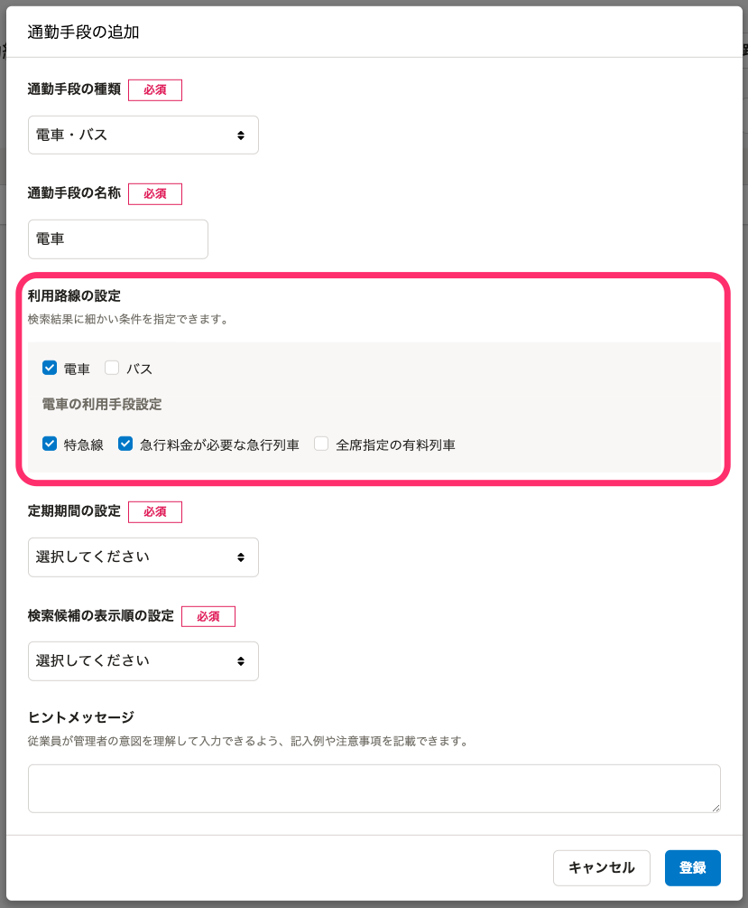
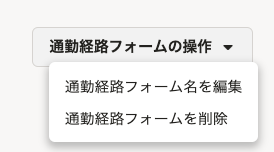
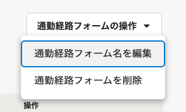

2022年3月7日（月）に行なったアップデートの詳細をお知らせします。

通勤経路検索機能の変更点は、改善1件、アクセシビリティ1件、不具合修正2件でした。

# 📈 改善

## 通勤手段に電車を指定した場合のみ、電車の詳細な検索条件を表示するようにしました

これまでは、 **［利用路線の設定］** で、電車を選択していなくても、電車の詳細な検索条件が表示されるようになっていました。

今回のリリースで、電車を指定した場合のみ、必要な検索条件が表示されるように改善しました。

| 変更前 | 変更後（電車を指定していない場合） | 変更後（電車を指定した場合） |
| --- | --- | --- |
|  |  |  |

# 🎢 アクセシビリティ

## ［通勤経路フォームの操作］を開いた際、どの操作が選択されているかを明示するようにしました

これまでは、 **［通勤経路フォームの操作▼］** を開いた際、どの操作が選択されているかが明示されず、キーボード操作時に選択されている操作がわかりづらくなっていました。

今回のリリースで、どの操作が選択されているかを明示する表示に改善しました。

| 変更前 | 変更後 |
| --- | --- |
|  |  |

# 👨‍⚕️ 不具合修正

通勤経路フォーム設定画面の表示に関する修正など、2件の不具合修正を行ないました。
