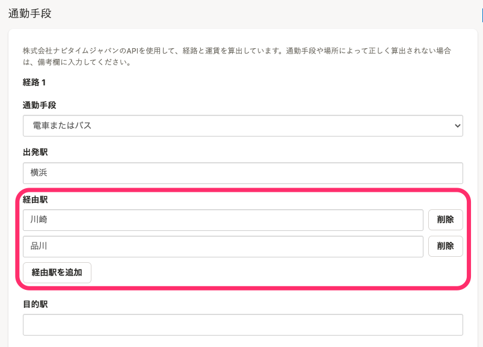
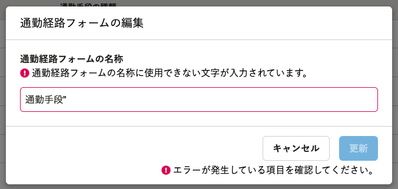

2022年3月22日（火）に行なったアップデートの詳細をお知らせします。

通勤経路検索機能の変更点は、改善3件でした。

# 📈 改善

## 経由駅を3つまで選べるようになりました

これまで、電車・バス、新幹線の経由駅は1つまでしか登録できませんでした。

今回のリリースで、経由駅を3つまで指定できるように改善しました。

## 通勤経路フォームの名称に使用できない文字が入力された場合にエラーを表示するようにしました

これまで、通勤経路フォームの名称に使用できない文字が入力されたとき、ボタンを押すまでエラーに気づきづらくなっていました。

今回のリリースで、使用できない文字を入力した時点でエラーが表示されるように改善しました。

## 駅を変更して経路候補を選ばなかった場合に、変更前の定期代などを空にするようにしました

これまで、従業員情報の編集画面などで、出発駅や目的駅を変更して経路候補を選ばなかった場合に、変更前の定期代や片道運賃の値が残ったままになっていました。

誤った金額の入力を防ぐため、駅を変更した時点で値を削除し、経路候補を選択するまで空にするように変更しました。
