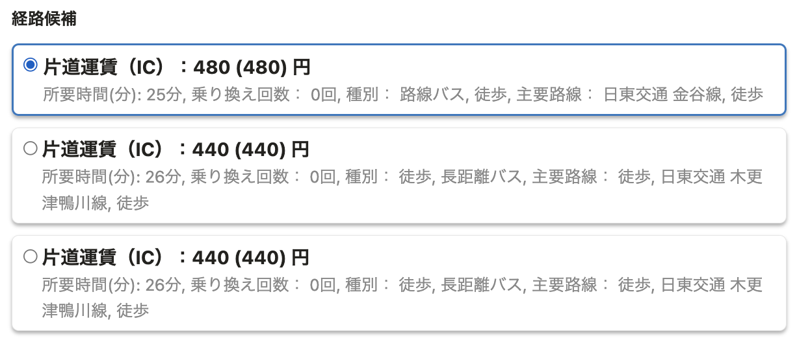
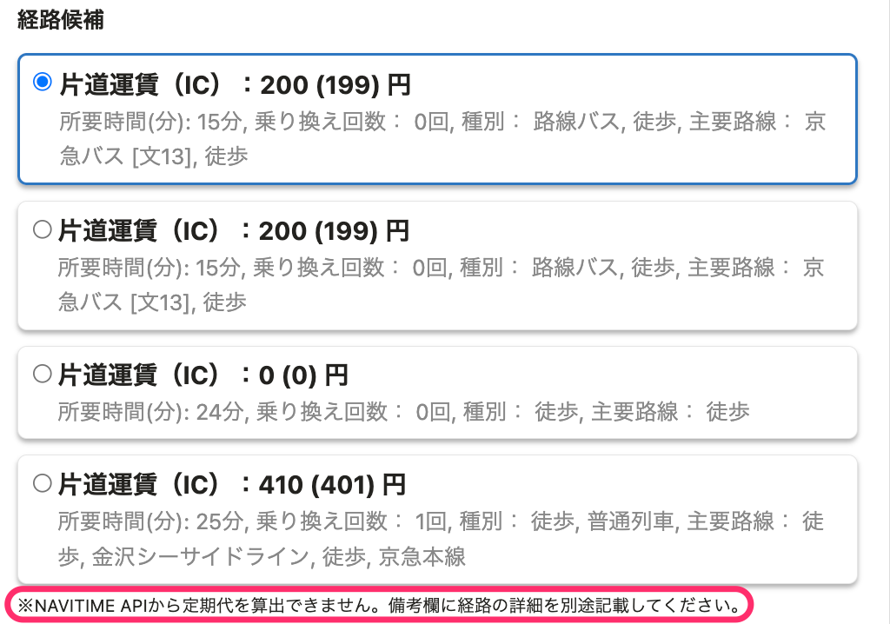

2022年4月5日（火）に行なったアップデートの詳細をお知らせします。

通勤経路検索機能の変更点は、改善1件でした。

# 📈 改善

## NAVITIME APIから定期代を算出できない場合のエラーメッセージを表示するようにしました

これまで、「電車・バス」の通勤手段で定期代の金額をNAVITIME APIから算出できなかった場合、エラーメッセージが表示されていませんでした。

そのため、定期代が0円で表示される理由がわからない状態となっていました。

今回のリリースで、対応方法がわかる内容のエラーメッセージを表示するように改善しました。

| 変更前 | 変更後 |
| --- | --- |
|  |  |
