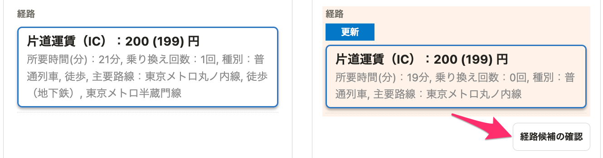
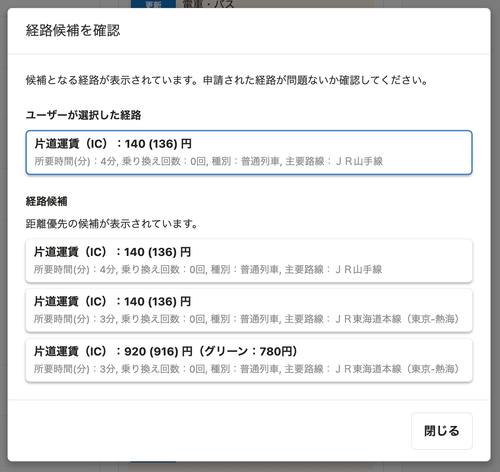

2022年4月27日（水）に行なったアップデートの詳細をお知らせします。
通勤経路検索機能の変更点は、改善1件でした。

# 📈改善
## 通勤手段が「電車・バス」のとき、申請者がどの候補から経路を選択したかを確認できるようになりました

これまで、「電車・バス」の通勤手段の場合に、申請者がどの候補から経路を選択したかを表示していませんでした。

そのため、最適な経路が選択されているかどうかを承認者側で確認できない状態となっていました。

今回のリリースで、 **［経路候補の確認］** から確認できるように変更しました。

