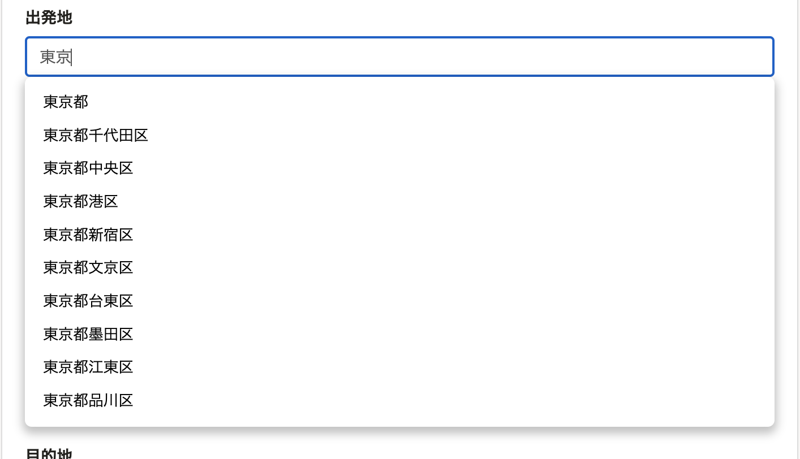
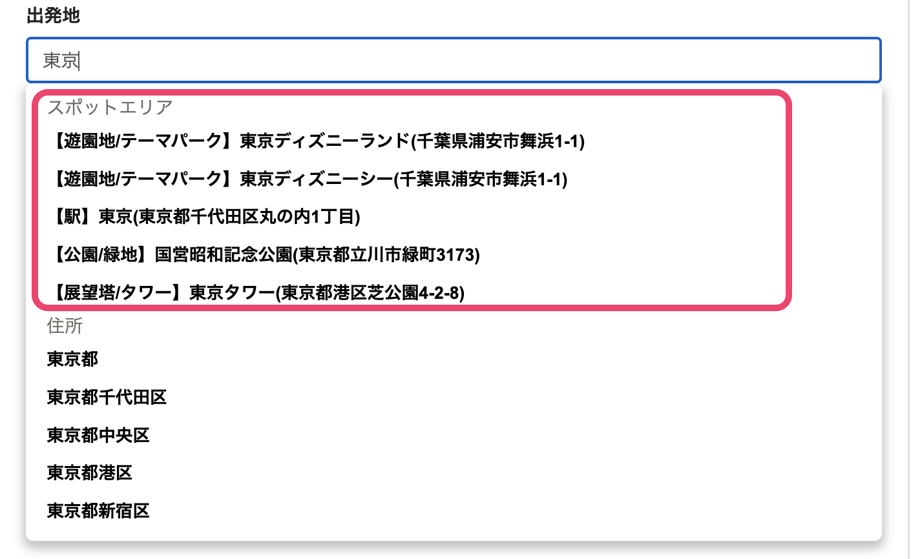

2022年5月16日（月）に行なったアップデートの詳細をお知らせします。
通勤経路検索機能の変更点は、改善1件・不具合修正1件でした。

# 📈改善
## 通勤手段が「自動車・自動二輪車・原動機付自転車」「徒歩・自転車」 のとき、出発地・目的地にスポットを入力できるようになりました
これまで、「自動車・自動二輪車・原動機付自転車」「徒歩・自転車」の通勤手段の場合、出発地・目的地の入力は住所のみでした。
今回のリリースで、インターチェンジのようなスポットを直接入力できるようにしました。
従来どおり、具体的な住所も登録できます。

| 変更前 | 変更後 |
| --- | --- |
|||

# 👨‍⚕️ 不具合修正
通勤経路フォームで複数経路を設定する際に関する1件の不具合修正を行ないました。