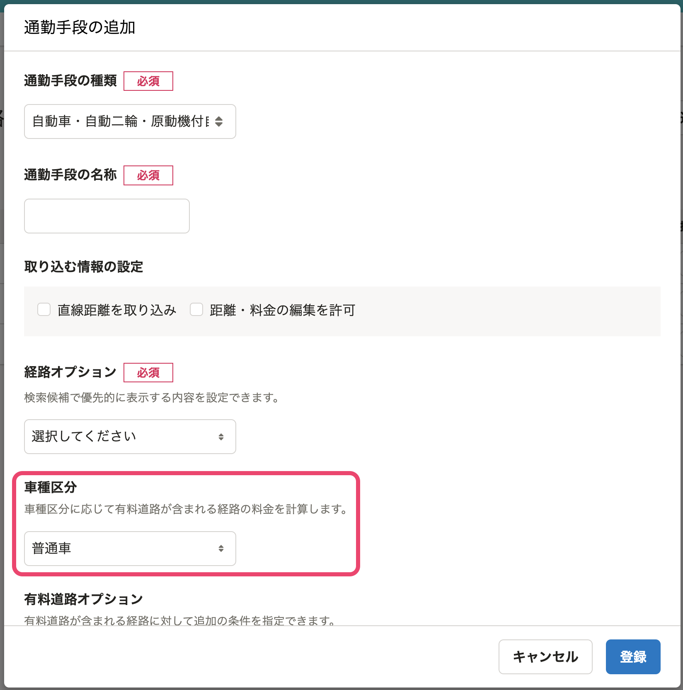
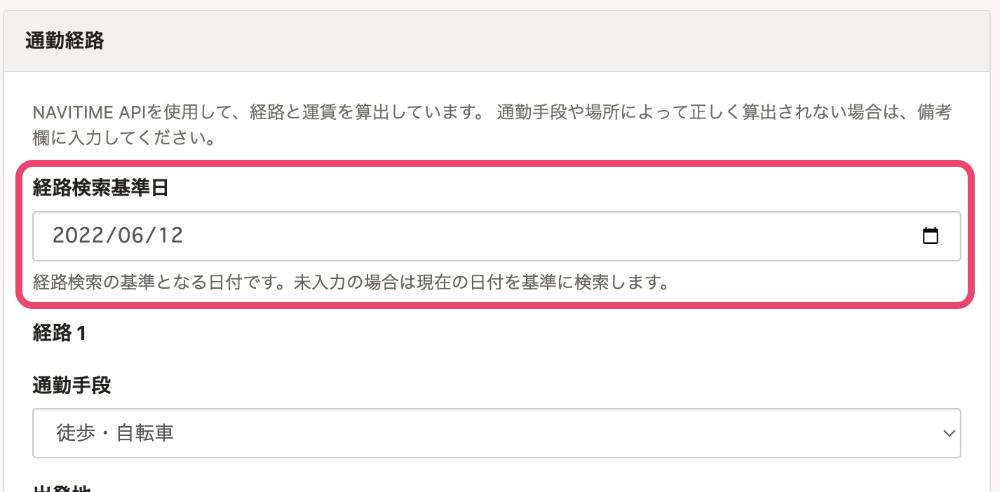

2022年6月7日（火）に行なったアップデートの詳細をお知らせします。

通勤経路検索機能の変更点は、改善2件でした。

# 📈改善
## 車種区分が「軽・二輪」の場合でも有料道路の料金を計算できるようにしました
これまで、通勤手段が「自動車・自動二輪車・原動機付自転車」の場合、有料道路の料金は車種区分が「普通車」のものを表示していました。

今回のリリースで、通勤手段の設定ごとに「軽・二輪」と「普通車」どちらの料金で検索するかを選べるようになりました。

車種区分は、新しい通勤手段を追加する際、もしくは既存の「自動車・自動二輪車・原動機付自転車」の通勤手段の編集画面で設定できます。

## 経路を検索する基準となる日付を設定できるようにしました
これまでは、経路検索の結果は、経路を入力した日のダイヤを利用したものを表示していました。

今回のリリースにより、指定した日付のダイヤでの検索ができるようになり、土日限定のダイヤなど、ユーザーさまが実際に利用する経路を探しやすくなりました。

また、未来の日付も指定できるため、ダイヤ改正が予定されている場合に、改正日を待たず事前に通勤費を設定できるようになりました。

