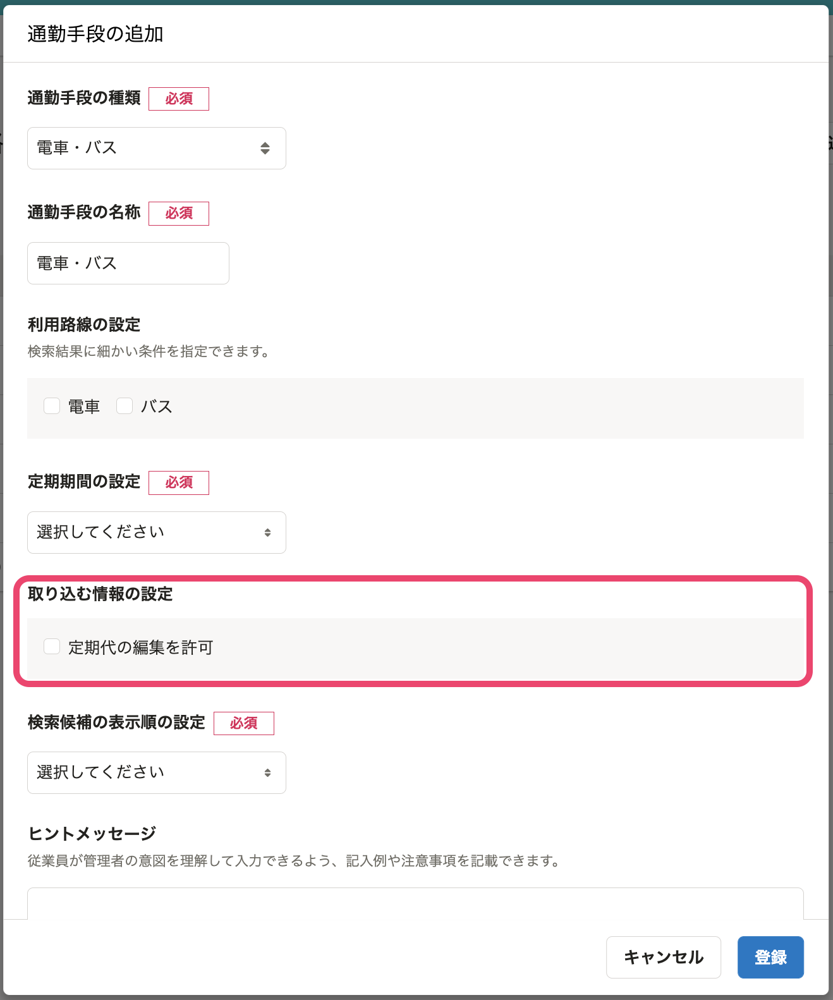

2022年6月20日（月）に行なったアップデートの詳細をお知らせします。

通勤経路検索機能の変更点は、改善1件でした。

# 📈改善
これまでは、定期代の項目は経路を入力した際に自動的に入力され、ユーザーさま自身で編集できませんでした。

そのため、定期代が正しく取得できなかった場合は備考欄に記載するなどの対応が必要でした。

今回のリリースで、定期代の編集を許可できるようにしました。

定期代の編集を許可すると、定期代が正しく取得できなかった場合でも定期代を直接入力でき、正しい金額を送信できます。

定期代の編集を許可するかどうかは、新しい通勤手段を追加する際、もしくは既存の「電車・バス」の通勤手段の編集画面で設定できます。

