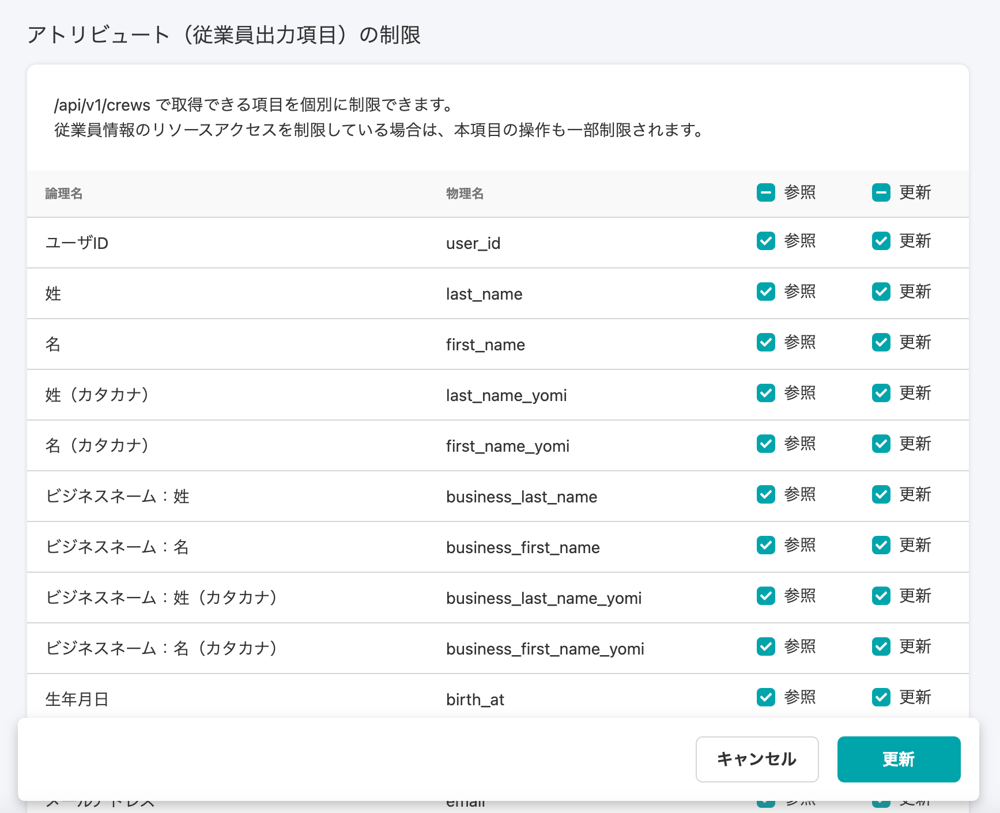

2021年2月4日（木）に行なったアップデートの詳細をお知らせします。

SmartHR APIの変更点は、新機能1件でした。

# ✨ 新機能

## APIの従業員項目を個別に権限制御できるようにしました

APIの従業員情報(/api/v1/crews)で取得できる項目を個別に制限できるようにしました。

:::related
[SmartHR API の設定がより細かく制御できるようになります](https://smarthr.jp/update/22031)
:::

**\[共通設定\]** > **\[アプリケーション連携\]** > **\[アクセストークン\]** 発行画面 > **\[アトリビュート（従業員出力項目）の制限\]** から設定できます。

アクセストークンの発行方法は、下記のヘルプページをご覧ください。

:::related
[アクセストークンの発行方法](https://knowledge.smarthr.jp/hc/ja/articles/360026266033)
:::

また、家族情報のAPIを公開し、APIで家族情報を操作できるようにしました。

詳しい内容は、APIのドキュメントをご確認ください。

:::related
[API Specifications - SmartHR for Developers](https://developer.smarthr.jp/api/index.html)
:::
