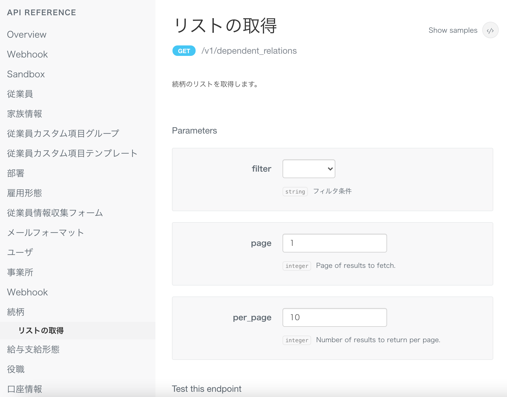
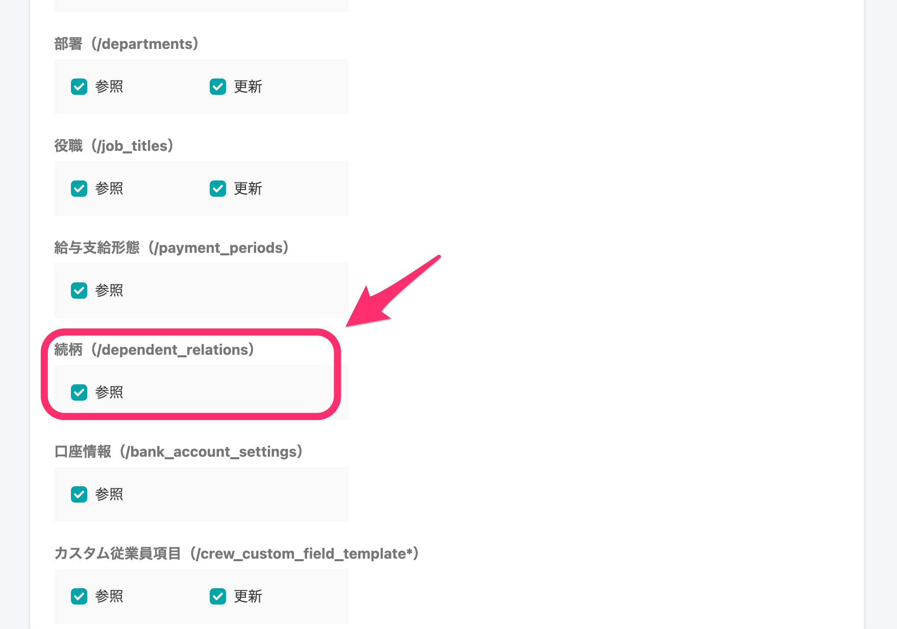

2021年2月9日（火）に行なったアップデートの詳細をお知らせします。

SmartHR APIの変更点は、新機能1件でした。

# ✨ 新機能

## 続柄マスターのAPIを公開しました

続柄情報のAPIを公開し、APIで続柄マスターの一覧の取得が可能になりました。

これにともない、アクセストークンの設定で、APIから従業員家族を追加するときに必要な続柄IDの参照権限をつけられるようにしました。

詳しい内容は、APIのドキュメントをご確認ください。

:::related
[API Specifications - SmartHR for Developers](https://developer.smarthr.jp/api/index.html)
:::
