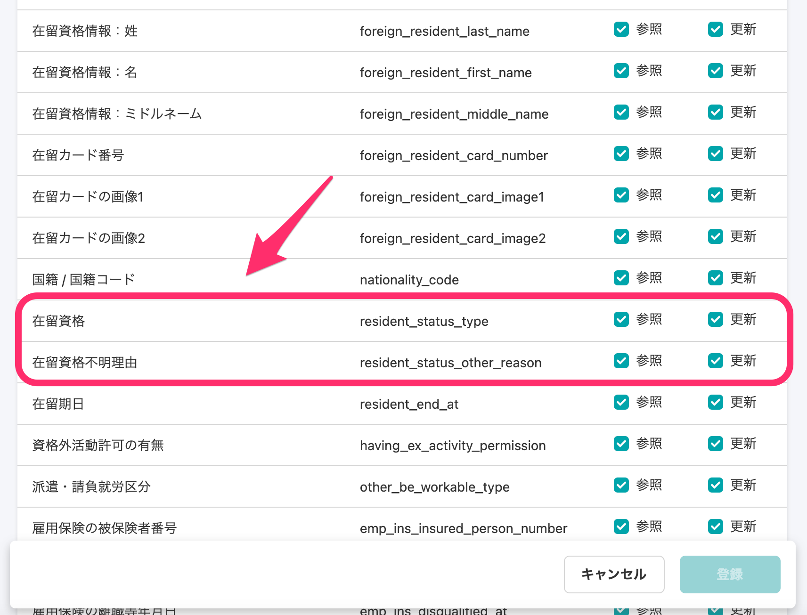

2021年2月10日（水）に行なったアップデートの詳細をお知らせします。

SmartHR APIの変更点は、新機能1件でした。

# ✨ 新機能

## APIで取得できる項目に在留資格を追加しました

APIの従業員情報（/api/v1/crews）で取得できる項目に、**\[在留資格\] \[在留資格不明理由\]** の2項目を追加しました。

これにより、従業員APIを通して在留資格項目の参照・更新が可能になります。

在留資格項目（resident\_status\_type）の「物理名」「論理名」については、下記のスプレッドシートでご確認ください。

:::related
[SmartHR-API区分リスト](https://docs.google.com/spreadsheets/d/1Tez9fCTMGP8b2ECa3dJMJElyWFNCPCbJNB-ka1jbF74/edit#gid=0)
:::

**\[共通設定\]** > **\[アプリケーション連携\]** > **\[アクセストークン\]** 発行画面 > **\[アトリビュート（従業員出力項目）の制限\]** から設定できます。

:::related
[アクセストークンの発行方法](https://knowledge.smarthr.jp/hc/ja/articles/360026266033)
[API Specifications - SmartHR for Developers](https://developer.smarthr.jp/api/index.html)
:::
