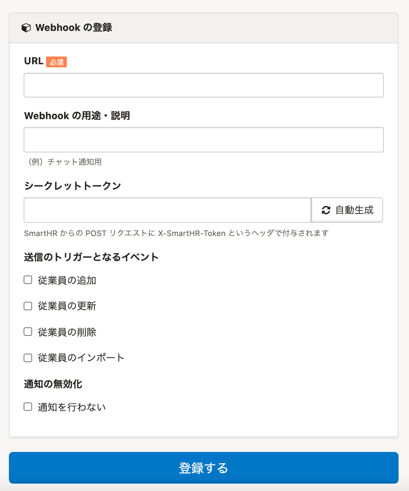

2021年3月17日（水）に行なったアップデートの詳細をお知らせします。

SmartHR APIの変更点は、新機能1件でした。

# ✨ 新機能

## Webhookで家族情報をトリガーにできるようにしました

これまではWebhook送信のトリガーとなる情報は従業員情報のみでしたが、家族情報もトリガーにできるようにしました。

家族情報の追加・更新・削除・インポートがあった際に、Webhookを利用して通知の設定が可能です。

| 変更前 | 変更後 |
| --- | --- |
|  |  |
