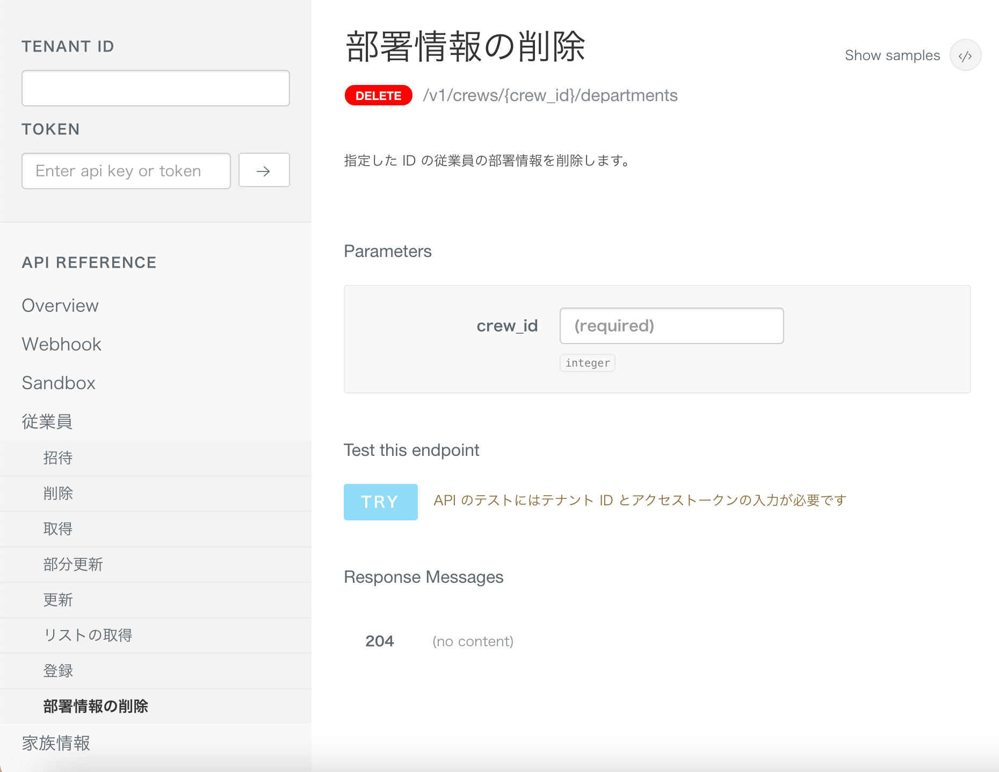

2021年3月19日（金）に行なったアップデートの詳細をお知らせします。

SmartHR APIの変更点は、新機能1件でした。

# ✨ 新機能

## ［部署情報の削除］のAPIを公開しました

 **［部署情報の削除］** のAPIを公開し、従業員に紐付いた部署の削除がAPIで可能になりました。

:::related
[API Specifications - SmartHR for Developers](https://developer.smarthr.jp/api/index.html)
:::
