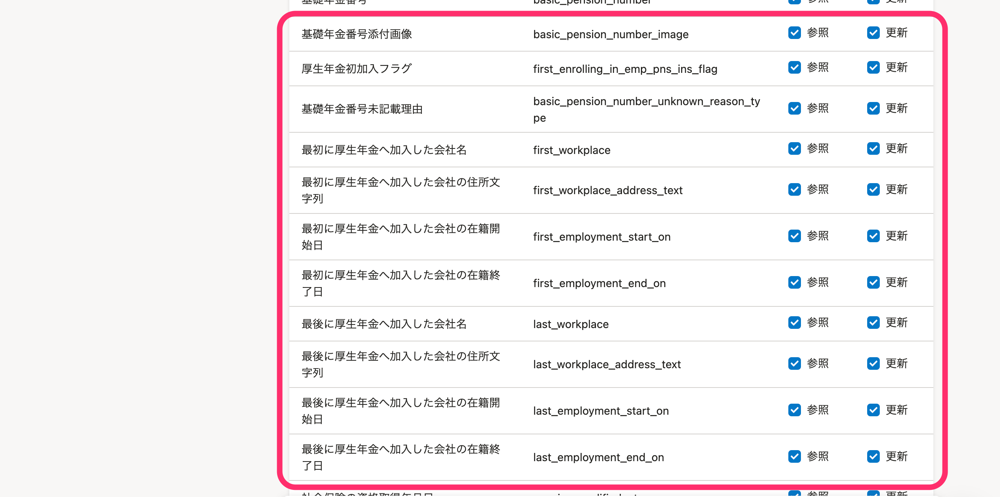

2021年3月24日（水）に行なったアップデートの詳細をお知らせします。

SmartHR APIの変更点は、カイゼン2件・不具合修正1件でした。

# 📈 カイゼン

## 従業員一覧取得のパフォーマンスをカイゼンしました

APIで従業員一覧を取得する際の内部パフォーマンスを最適化し、処理速度をカイゼンしました。

## 従業員情報と家族情報の参照・更新できる項目を追加しました

APIで参照・更新できる従業員項目に、雇用保険と社会保険に関する項目を下図のとおり追加しました。

**アトリビュート（従業員出力項目）画面**

また、家族情報（Dependent）の以下の項目を参照・更新できるようにしました。

- 母子手帳の画像（maternity\_handbook\_image）

:::related
[アクセストークンの発行方法](https://knowledge.smarthr.jp/hc/ja/articles/360026266033)
:::

# 👨‍⚕️ 不具合修正

API仕様書のID記載に関する1件の不具合修正を行ないました。
