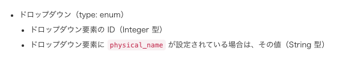
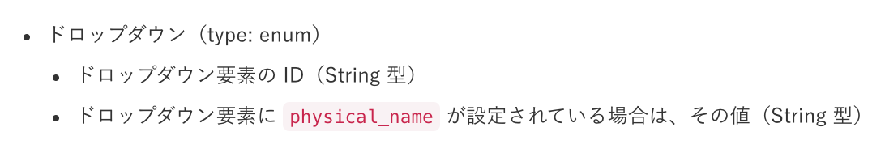
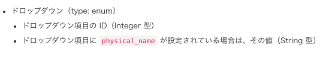
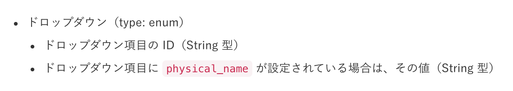

2021年6月25日（金）に行なったアップデートの詳細をお知らせします。

SmartHR APIの変更点は、カイゼン1件でした。

# 📈 カイゼン

## 従業員情報の取得についての説明を実態に合わせたものに変更しました

従業員情報を取得する際のレスポンス内に含まれるカスタム従業員項目のIDの型表記の説明を **［Integer］** から **［String］** に変更して実態と合わせました。

:::related
[SmartHR API > 従業員 > 取得](https://developer.smarthr.jp/api/index.html#!/%E5%BE%93%E6%A5%AD%E5%93%A1/getV1CrewsId)
:::

変更した説明箇所は以下のとおりです。

-  **［従業員］>［取得］** の **［カスタム項目の表現について］** に記載されている、ドロップダウン要素のIDの型を変更

| 変更前 | 変更後 |
| --- | --- |
|  |  |

-  **［従業員］>［リストの取得］** の **［カスタム項目の表現について］** に記載されている、ドロップダウン項目のIDの型を変更

| 変更前 | 変更後 |
| --- | --- |
|  |  |
