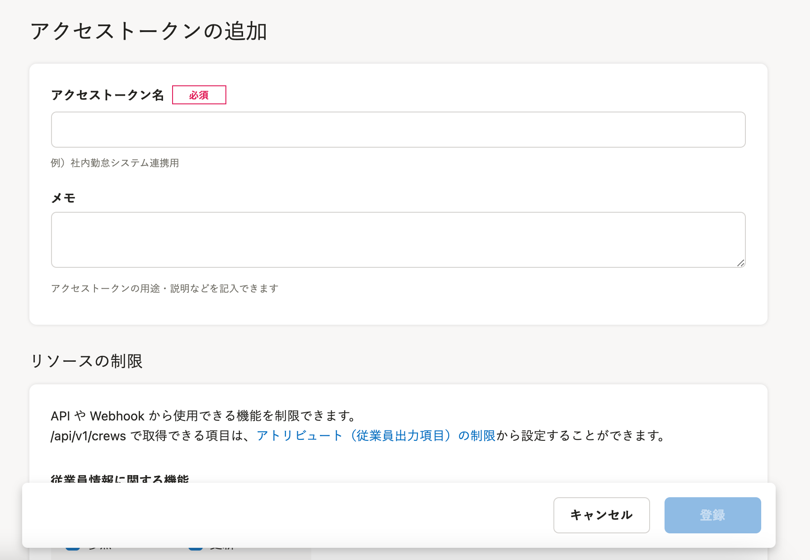
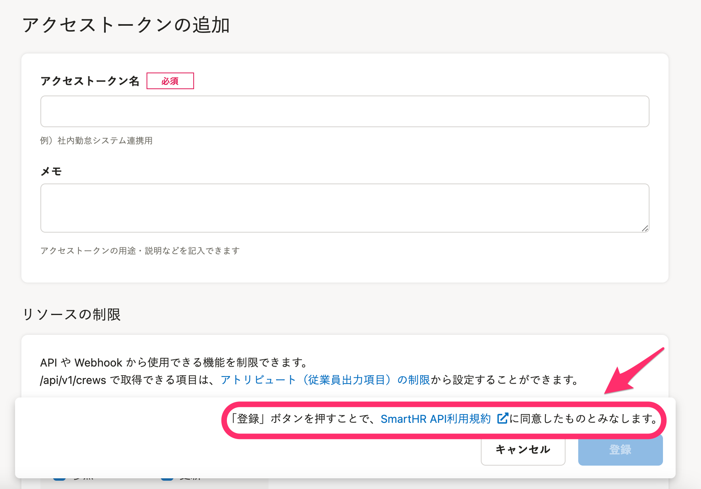

2021年7月16日（金）に行なったアップデートの詳細をお知らせします。

SmartHR APIの変更点は、カイゼン1件でした。

# 📈 カイゼン

## アクセストークン登録画面にAPI利用規約への導線を設置しました

APIの利用規約がなかったため、規約ページを新たに作成しました。

[SmartHR API利用規約](https://developer.smarthr.jp/terms/index.html)

アクセストークンを追加する際に **［登録］** をクリックすると、規約に同意したとみなす仕様にしました。

| 変更前 | 変更後 |
| --- | --- |
|  |  |
