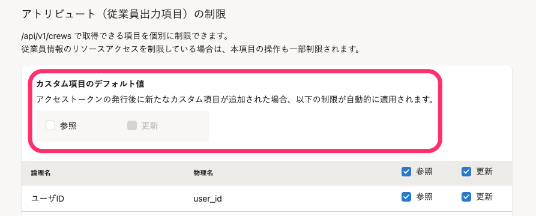

2021年8月25日（水）に行なったアップデートの詳細をお知らせします。

SmartHR APIの変更点は、新機能1件でした。

# ✨ 新機能

## アクセストークンを発行したあとに追加したカスタム従業員項目に対して、デフォルト権限を指定できるようにしました

これまでは、アクセストークンを発行したあとに作成したカスタム従業員項目に対して、デフォルト設定では参照権限のない状態になっていました。

この仕様では、従業員に参照・更新の権限を付与したい場合は、カスタム項目の追加後に、アクセストークンの管理画面 >  **［アトリビュート（従業員出力項目）の制限］** から **［参照］［更新］** を設定する必要がありました。

そのため今回のリリースにより、アクセストークンを設定した際に、新規で追加されたカスタム従業員項目に対して、デフォルトの権限を指定できるようにしました。

これにより、一連の操作をAPIのみで完結できるようになります。

:::related
[アクセストークンの発行方法](https://knowledge.smarthr.jp/hc/ja/articles/360026266033)
:::
