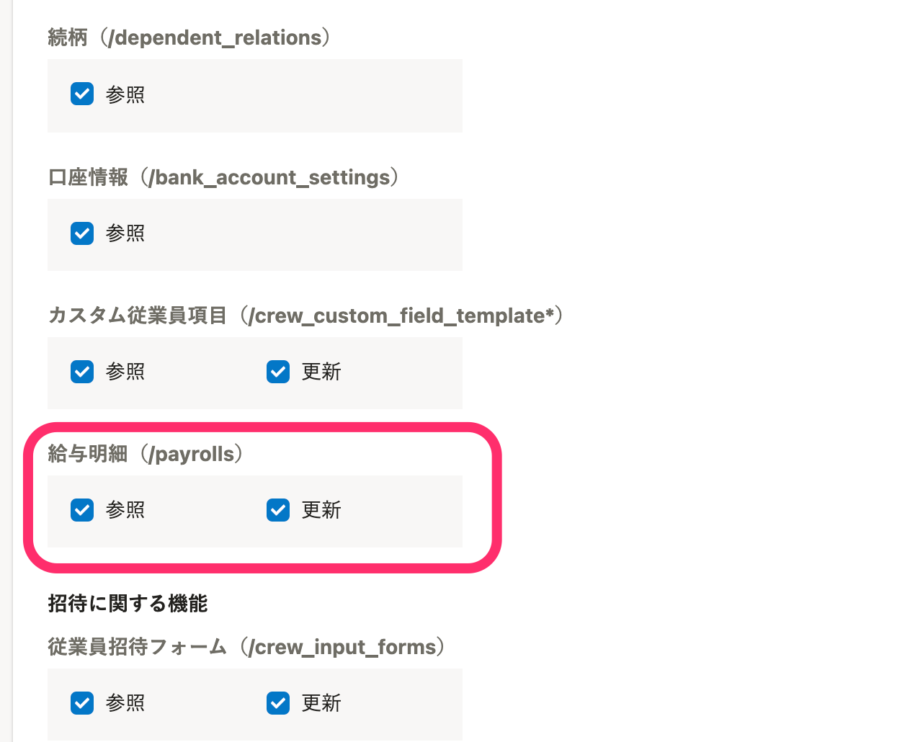

2021年9月1日（水）に行なったアップデートの詳細をお知らせします。

SmartHR APIの変更点は、新機能1件でした。

# ✨ 新機能

## 給与明細のAPIを公開しました

 **［給与明細］** のAPIを公開し、APIで給与明細に関する操作が可能になりました。

あわせて、アクセストークンの設定で、APIから給与明細の **［参照］［更新］** の権限をつけられるようにしました。

:::related
[API Specifications - SmartHR for Developers](https://developer.smarthr.jp/api/index.html)
:::
