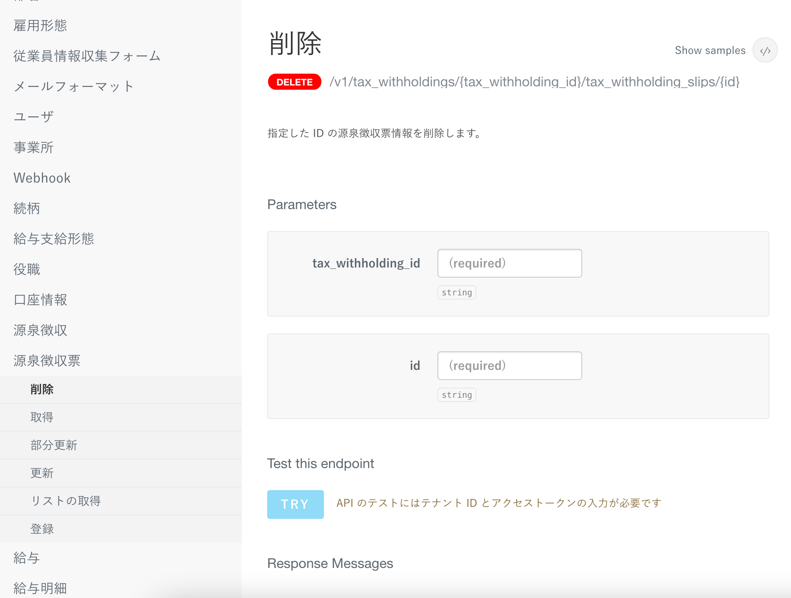
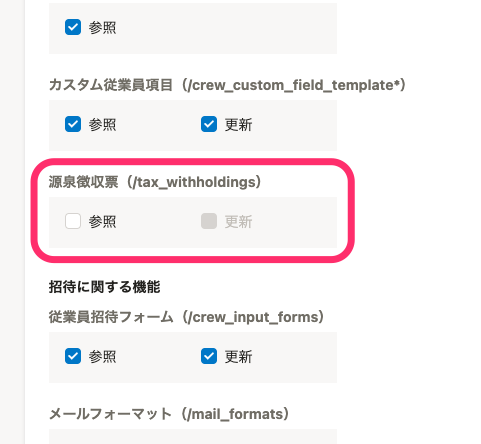

2021年9月10日（金）に行なったアップデートの詳細をお知らせします。

SmartHR APIの変更点は、新機能1件でした。

# ✨ 新機能

## 源泉徴収票のAPIを公開しました

 **［源泉徴収票］** のAPIを公開し、源泉徴収票に関する操作が可能になりました。

あわせて、アクセストークンの設定で、APIから源泉徴収票の **［参照］［更新］** の権限を設定できるようにしました。

