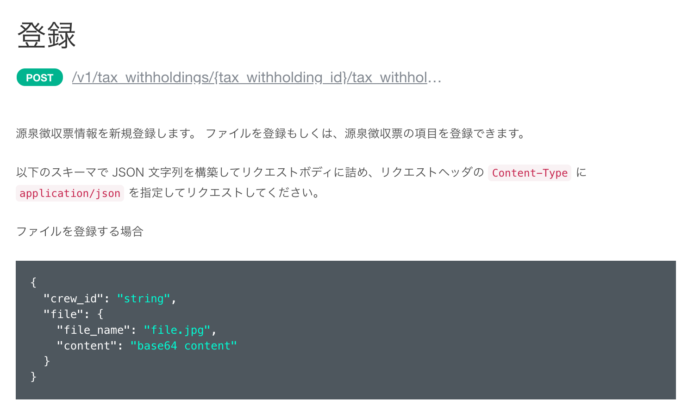
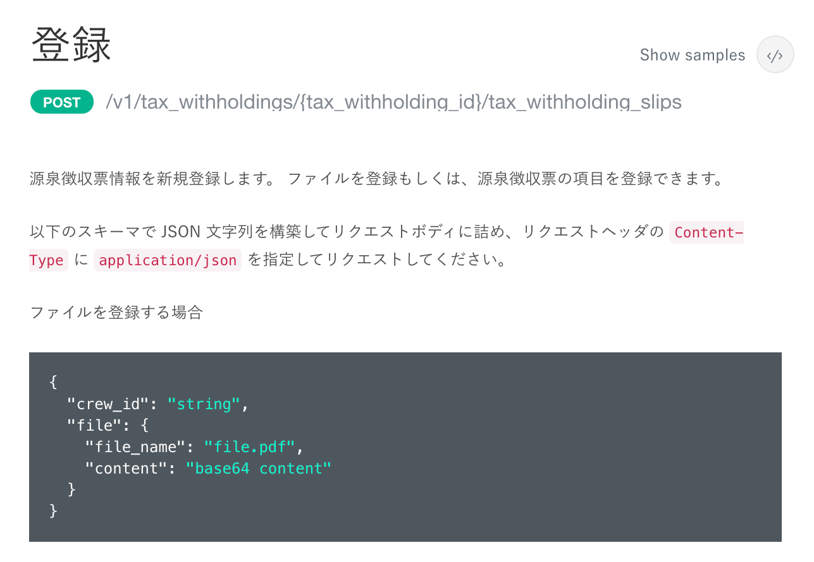

2021年9月28日（火）に行なったアップデートの詳細をお知らせします。

SmartHR APIの変更点は、カイゼン1件でした。

# 📈 カイゼン

## 源泉徴収票の［登録］のサンプル表記を変更しました

APIドキュメントの源泉徴収票の項目にある **［登録］** のサンプルで、ファイルを登録する場合の拡張子が「jpg」になっていたため、実際に登録できる拡張子の「pdf」に変更しました。

| 変更前 |  |
| --- | --- |
| 変更後 |  |
