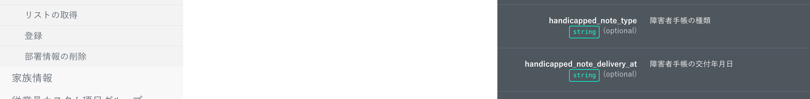
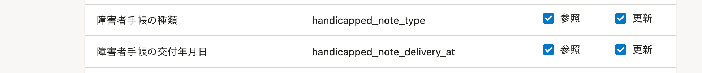

2021年10月18日（月）に行なったアップデートの詳細をお知らせします。

SmartHR APIの変更点は、カイゼン3件でした。

# 📈 カイゼン

## 従業員情報の［障害者手帳の種類］と［障害者手帳の交付年月日］をAPIに追加しました

従業員情報の **［障害者手帳の種類］** と **［障害者手帳の交付年月日］** の項目をAPIで取りあつかえるようにしました。

あわせて、アクセストークンの設定で、APIから **［障害者手帳の種類］** と **［障害者手帳の交付年月日］** の **［参照］［更新］** の権限をつけられるようにしました。

## APIドキュメントの項目名を一部変更しました

従業員情報の項目名変更にあわせて、APIドキュメントに記載されている対象の項目名を変更しました。

:::related
[2021/10/12 従業員情報・家族情報に［障害者手帳の種類］と［障害者手帳の交付年月日］の項目を追加し、一部の項目名を変更しました](https://knowledge.smarthr.jp/hc/ja/articles/4407754249497)
:::

## レスポンスヘッダーにアクセス回数上限の情報を記載するようにしました

エラー系レスポンスの場合、アクセス回数上限に関する情報がAPIのレスポンスに記載されないことがありました。

今回のリリースで、すべてのレスポンスにおいて以下の情報が含まれるようにカイゼンしました。

- X-Rate-Limit-Limit
- X-Rate-Limit-Reset
- X-Rate-Limit-Remaining
