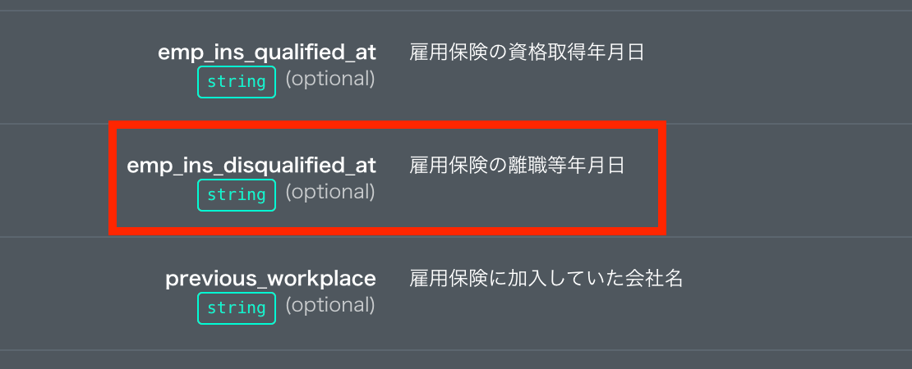
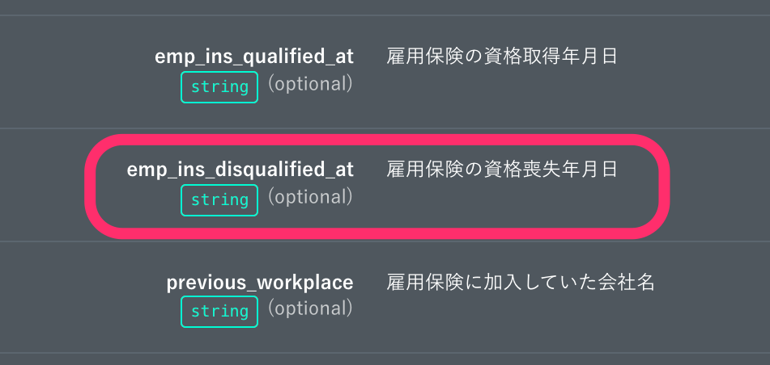
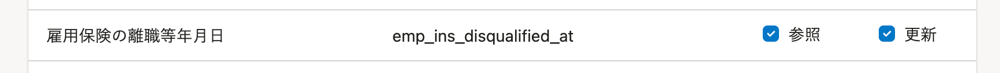
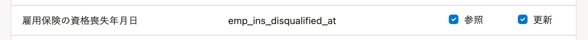

2021年11月19日（金）に行なったアップデートの詳細をお知らせします。

SmartHR APIの変更点は、改善1件でした。

# 📈 改善

## APIのドキュメントとアクセストークンの従業員項目名を更新しました

SmartHR基本機能の従業員情報の項目名変更にあわせて、APIドキュメントとアクセストークンの従業員情報の項目名 **［雇用保険の離職等年月日］** を **［雇用保険の資格喪失年月日］** に更新しました。

APIドキュメント

| 変更前 | 変更後 |
| --- | --- |
|  |  |

アクセストークン

| 変更前 | 変更後 |
| --- | --- |
|  |  |
