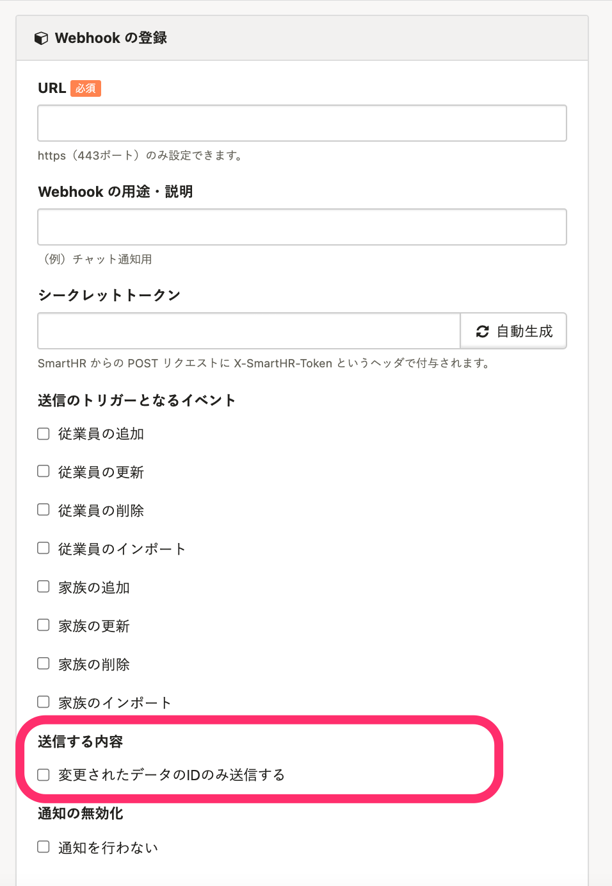

2022年1月5日（水）に行なったアップデートの詳細をお知らせします。

SmartHR APIの変更点は、改善1件でした。

# 📈 改善

## 変更されたデータのIDのみを送信するオプションをWebhookに追加しました

これまではWebhookが送信される場合、該当の従業員の情報がすべて送信される仕様でした。

そのため、従業員情報や家族情報など、開発の際には閲覧したくない情報が含まれていました。

今回の改修で、Webhookの登録画面に **［送信する内容］** の項目を追加し、変更されたデータのIDのみを送信できるようにしました。

この機能を使うと、変更対象のレコードのIDのみを受け取れるため、適切な権限設定をしたアクセストークンと組み合わせて、閲覧すべき情報のみにアクセスしながら連携の実装が可能です。

