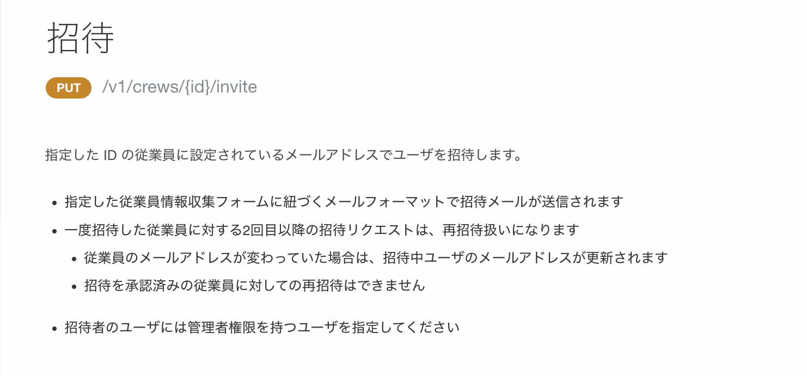
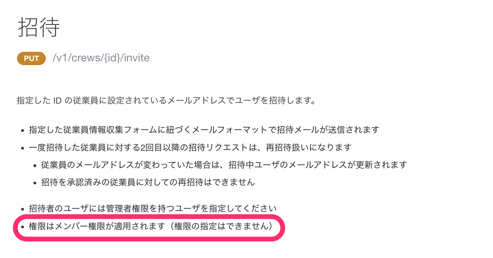

2022年3月7日（月）に行なったアップデートの詳細をお知らせします。

SmartHR APIの変更点は、改善1件でした。

# 📈 改善

## 従業員招待APIの説明文に、招待時に権限の指定はできない旨を追記しました

APIでは権限を指定して招待できないため、従業員招待のAPIドキュメントに以下の説明文を追記しました。

 **権限はメンバー権限が適用されます（権限の指定はできません）** 

| 変更前 |  |
| --- | --- |
| 変更後 |  |
