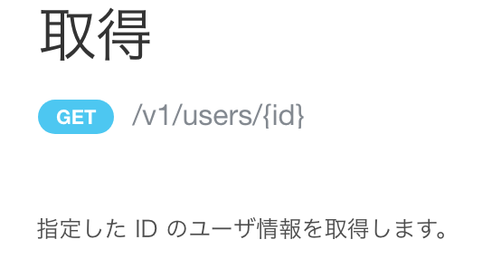
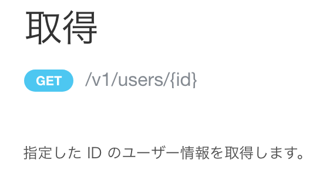

2022年4月22日（金）に行なったアップデートの詳細をお知らせします。

SmartHR APIの変更点は、改善1件でした。

# 📈改善

## APIドキュメントの文言をSmartHRの表記ルールに揃えました

APIドキュメントの文言の一部がSmartHR全体の表記ルールに沿っていなかったため、表記ルールに合わせて文言を変更しました。

|  変更前  |  変更後  |
| ---- | ---- |
|  |    |
